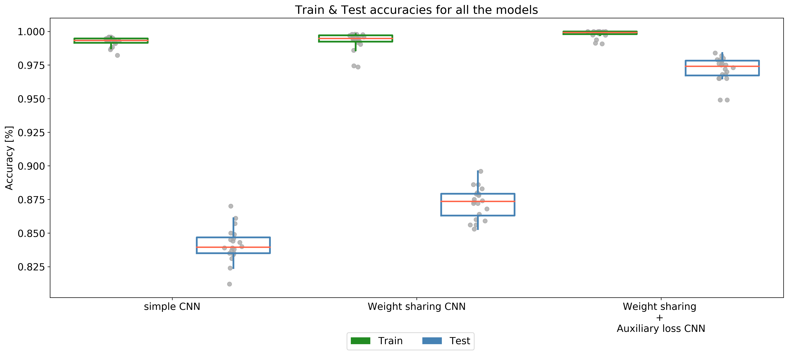

# Goal
The goal of this small project is to train different deep architectures to predict whether the first MNIST image number is smaller or equal to the second MNIST image number.

# Dataset
The dataset is loaded from the dlc_prologue.py provided by in the scope of the Deep Learning class of EPFL (EE-559). The train set consist of 1000 train pairs of 14x14 grayscale MNIST images, and 1000 test pairs of 14x14 grayscale MIST images. The label is binary :
* 1 : image 1 <= image 2
* 0 : image 1 > image 2
In addition to the target, the class of each image (= the digit represented) is also provided.

# Models
## Simple CNN

## Weight Sharing CNN

## Auxiliary Loss CNN

# Data Augmentation
To increase the number of training samples, a data augmentation is performed. It consists of translating the image in 9 possible directions by one pixel differently for both images. Another augmentation consists of flipping the pairs which to get a new configuration of images.

# Performances

# Contribution
This project has been made by Sacha Haidinger, Nils Olsen, and Antoine Spahr
